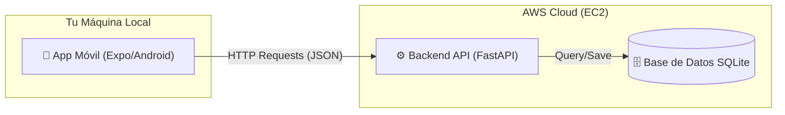

# Sporting Court App - Documentación del Proyecto

Este proyecto es una aplicación móvil y web para la gestión y reserva de canchas deportivas. Actualmente opera en una arquitectura híbrida con un backend remoto y clientes locales.

## 🏗️ Arquitectura del Sistema

El sistema opera bajo un modelo **Cliente-Servidor Híbrido**:
*   **Backend (Servidor):** Alojado remotamente en AWS EC2.
*   **Frontend (Cliente):** Ejecutándose localmente en tu máquina (Emulador Android).



### Componentes

1.  **Backend (Remoto)**
    *   **Ubicación:** AWS EC2 (`http://54.226.21.206:8080`)
    *   **Tecnología:** Python (FastAPI), Uvicorn.
    *   **Estado:** ✅ **ACTIVO**. Sirve la API RESTful en `/api/v1`.

2.  **Aplicación Móvil (Local)**
    *   **Ubicación:** Local (`Sporting-Court-App-m-vil`)
    *   **Tecnología:** React Native, Expo.
    *   **Estado:** ✅ **ACTIVO**. Configurada para consumir la API remota.

---

## 🚀 Guía de Instalación y Ejecución

### Prerrequisitos
*   Node.js y npm instalados.
*   Android Studio y SDK configurados (para el emulador).
*   Expo CLI (opcional, pero recomendado).

### 1. Ejecutar la Aplicación Móvil (Local)

Para ejecutar la app móvil y conectarla al backend remoto:

1.  Navega a la carpeta del proyecto móvil:
    ```powershell
    cd Sporting-Court-App-m-vil
    ```
2.  Instala las dependencias:
    ```powershell
    npm install
    ```
3.  Inicia el servidor de desarrollo de Expo:
    ```powershell
    npm start
    ```
4.  Presiona `a` en la terminal para abrir la aplicación en el emulador de Android.

> [!TIP]
> Si el emulador no se abre automáticamente, puedes iniciarlo manualmente con:
> ```powershell
> & "C:\Users\jqnfu\AppData\Local\Android\Sdk\emulator\emulator.exe" -avd Medium_Phone_API_36.1
> ```

### 2. Ejecutar la Aplicación Web (Local - Opcional)

Si deseas ejecutar la versión web localmente:

1.  Navega a la carpeta `backend`:
    ```powershell
    cd backend
    ```
2.  Ejecuta el servidor web local:
    ```powershell
    npm run dev:8081
    ```
3.  Abre `http://127.0.0.1:8081` en tu navegador.

---

## 📦 Generar APK con EAS Build

Para generar un archivo APK instalable para Android usando EAS (Expo Application Services):

1.  Asegúrate de tener `eas-cli` instalado o usa `npx`.
2.  Ejecuta el comando de build para el perfil de desarrollo (o producción según necesites):
    ```powershell
    npx eas-cli build --profile development --platform android
    ```
3.  Sigue las instrucciones en pantalla.

### Ver Logs y Descargar APK
Puedes ver el historial de builds y descargar los APKs generados usando:

```powershell
npx eas-cli build:list --limit 1
```

O visitando tu dashboard en Expo:
[https://expo.dev/accounts/juako3239/projects/unab-sporting-mobile/builds](https://expo.dev/accounts/juako3239/projects/unab-sporting-mobile/builds)

> [!NOTE]
> **Último Build Exitoso:** [Ver Logs y Descargar](https://expo.dev/accounts/juako3239/projects/unab-sporting-mobile/builds/d8f6c6c8-34eb-489a-8169-794de8f95b89)
